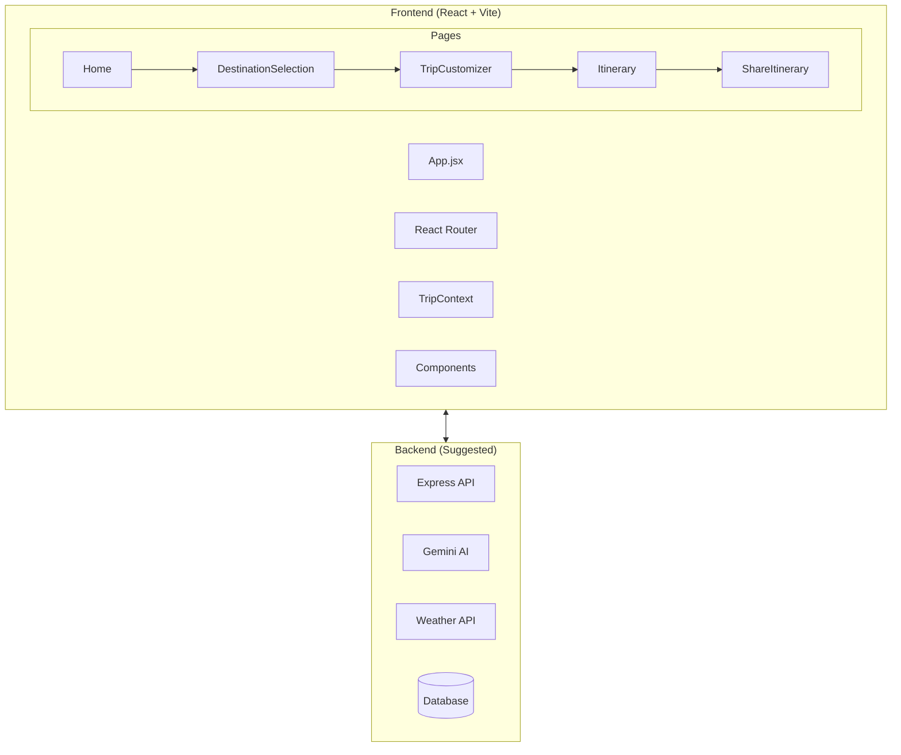

# VoyageMindAI - Frontend Technical Workflow

## 🏗️ Architecture Overview



---

## 📁 File Structure

```
src/
├── main.jsx                 # React entry point
├── App.jsx                  # Router + TripProvider wrapper
├── index.css                # Tailwind + responsive styles
├── context/
│   └── TripContext.jsx      # Global state management
├── components/
│   ├── Navbar.jsx           # Mobile-responsive navigation
│   └── Footer.jsx           # Site footer
└── pages/
    ├── Home.jsx             # Landing page
    ├── DestinationSelection.jsx  # Step 1: Choose destination
    ├── TripCustomizer.jsx   # Step 2: Configure trip
    ├── Itinerary.jsx        # Step 3: View generated plan
    ├── ShareItinerary.jsx   # Step 4: Export & share
    ├── About.jsx            # Company info
    └── Contact.jsx          # Contact form
```

---

## 🔄 User Flow

| Step | Page | Action |
|------|------|--------|
| 1 | Home | Click "Get Started" |
| 2 | Destination | Select destination → Next |
| 3 | Customizer | Set dates, budget (₹), pace, interests → Start Build |
| 4 | Itinerary | View AI-generated plan → Share |
| 5 | Share | Download PDF / Sync Calendar / Share Link |

---

## 📦 State Management (TripContext)

```javascript
// State shape
{
  destination: { name, country, image },
  dates: { start, end },
  budget: { amount, style },  // ₹ INR, style: Backpacker|Luxury|Standard
  pace: 'Chill' | 'Active' | 'Intense',
  interests: ['food', 'history', ...],
  itinerary: []  // From backend API
}
```

### Available Actions
| Function | Description |
|----------|-------------|
| `updateDestination(obj)` | Set destination |
| `updateDates(obj)` | Set travel dates |
| `updateBudget(obj)` | Set budget amount & style |
| `updatePace(str)` | Set daily pace |
| `toggleInterest(id)` | Add/remove interest |
| `updateItinerary(arr)` | Store generated itinerary |
| `resetTrip()` | Clear all data |

---

## 📱 Responsive Breakpoints

| Breakpoint | Width | Target |
|------------|-------|--------|
| Mobile | < 640px | Phones |
| Tablet | 641-1024px | iPads, small laptops |
| Desktop | > 1025px | Desktops, large screens |

### Mobile Features
- Hamburger menu navigation
- Touch-friendly 48px minimum targets
- Stacked card layouts
- iOS zoom prevention (16px inputs)
- Safe area support for notches

---

## 🔌 Backend API Integration Points

### 1. Generate Itinerary
**Triggered:** TripCustomizer → "Start Build"

```http
POST /api/generate-itinerary
Content-Type: application/json

{
  "destination": "Goa",
  "startDate": "2024-09-15",
  "endDate": "2024-09-20",
  "budget": { "amount": 50000, "style": "Luxury" },
  "pace": "Active",
  "interests": ["food", "history", "nature"]
}
```

**Expected Response:**
```json
{
  "itinerary": [
    {
      "day": 1,
      "title": "The Old Coast",
      "activities": [
        {
          "time": "9:00 AM",
          "category": "CULTURE",
          "title": "Basilica of Bom Jesus",
          "description": "...",
          "image": "https://..."
        }
      ]
    }
  ],
  "hotel": {
    "name": "Heritage Villa",
    "description": "..."
  }
}
```

### 2. Weather Check
**Triggered:** Before generating itinerary

```http
GET /api/weather?location=Goa&dates=2024-09-15,2024-09-20
```

**Response:** Weather data to optimize outdoor activities

### 3. Export Itinerary
**Triggered:** Share page actions

```http
POST /api/export/pdf
POST /api/export/calendar
POST /api/share/link
```

---

## 💡 Backend Implementation Suggestions

### Recommended Stack
| Component | Technology | Purpose |
|-----------|------------|---------|
| Server | Express.js | API endpoints |
| AI | Google Gemini API | Itinerary generation |
| Weather | OpenWeatherMap | Weather forecasts |
| Database | MongoDB / PostgreSQL | User data, saved trips |
| Auth | JWT + bcrypt | User authentication |
| Cache | Redis | API response caching |

### Suggested Backend Structure
```
backend/
├── server.js              # Express entry
├── routes/
│   ├── itinerary.js       # POST /api/generate-itinerary
│   ├── weather.js         # GET /api/weather
│   └── export.js          # Export endpoints
├── services/
│   ├── geminiService.js   # AI integration
│   ├── weatherService.js  # Weather API
│   └── pdfService.js      # PDF generation
├── middleware/
│   ├── auth.js            # JWT validation
│   └── rateLimit.js       # API rate limiting
└── config/
    └── env.js             # Environment variables
```

### Key Backend Features to Implement

1. **AI Itinerary Generation**
   - Use Gemini API with structured prompts
   - Include destination context, budget, pace
   - Return day-by-day activities with times

2. **Weather-Aware Scheduling**
   - Check weather for travel dates
   - Swap outdoor activities on rainy days
   - Add weather alerts to response

3. **Smart Hotel Recommendations**
   - Base on destination + budget style
   - Calculate proximity to activities
   - Include booking links

4. **Export Features**
   - PDF: Use puppeteer or jsPDF
   - Calendar: Generate .ics files
   - Share: UUID-based public links

5. **Rate Limiting**
   - Limit AI calls per user
   - Cache popular destinations
   - Queue long-running requests

---

## 🚀 Getting Started

```bash
# Install dependencies
npm install

# Run development server
npm run dev

# Build for production
npm run build
```

---

## 👥 Team

| Name | Role |
|------|------|
| Santhosh | Full Stack Developer (Team Lead) |
| Mughal Rayhan | Web Tester |
| Bharath | UX Designer |

---

## 📋 Next Steps

1. [ ] Set up Express backend with routes
2. [ ] Integrate Gemini API for itinerary generation
3. [ ] Add OpenWeatherMap integration
4. [ ] Implement PDF export with puppeteer
5. [ ] Add user authentication
6. [ ] Deploy frontend to Vercel/Netlify
7. [ ] Deploy backend to Railway/Render
